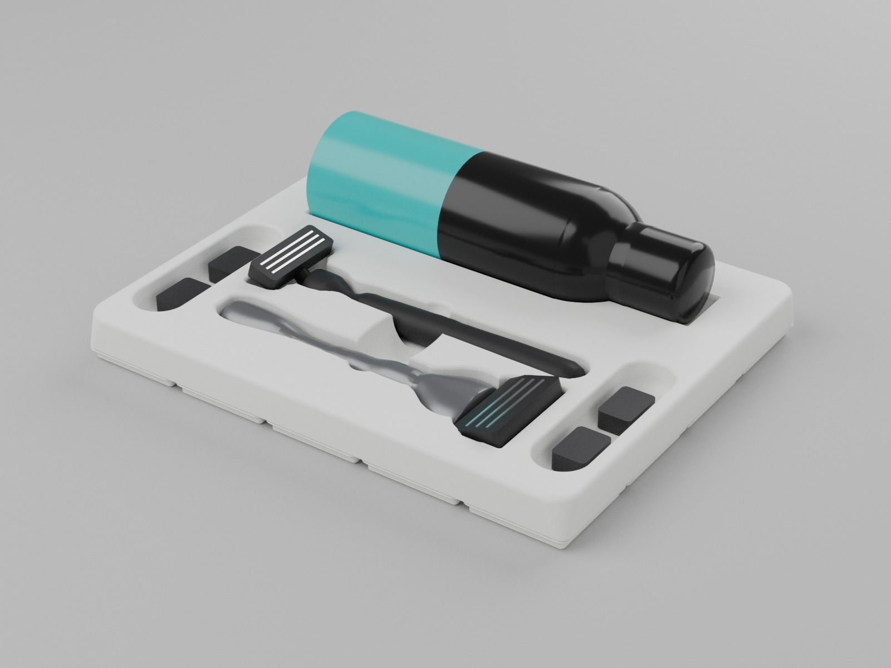
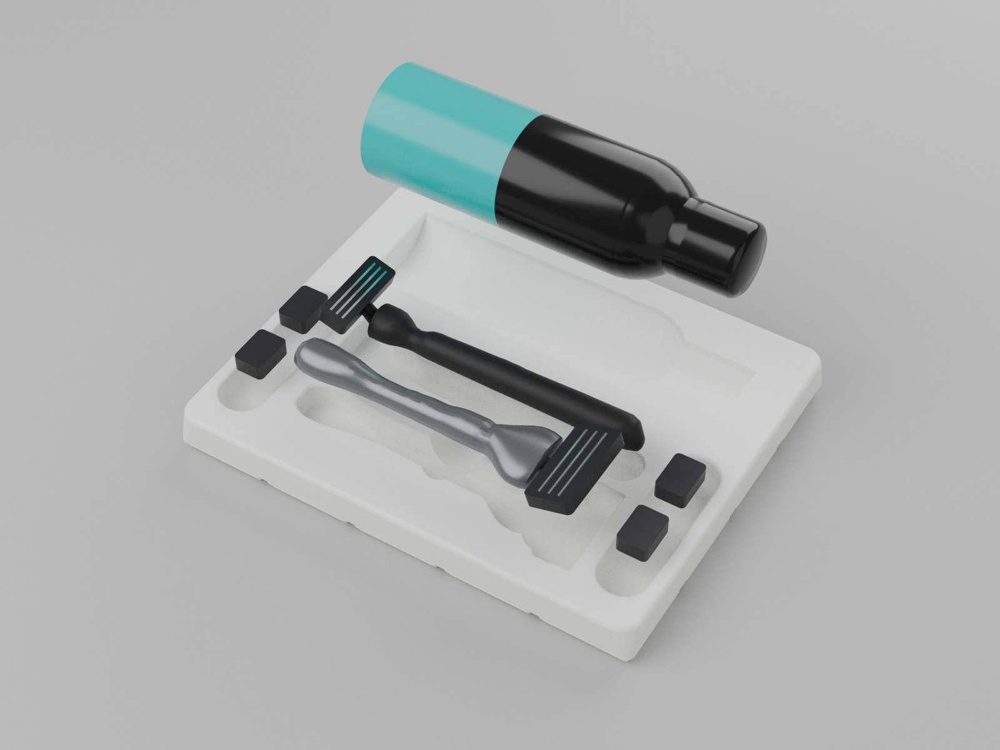
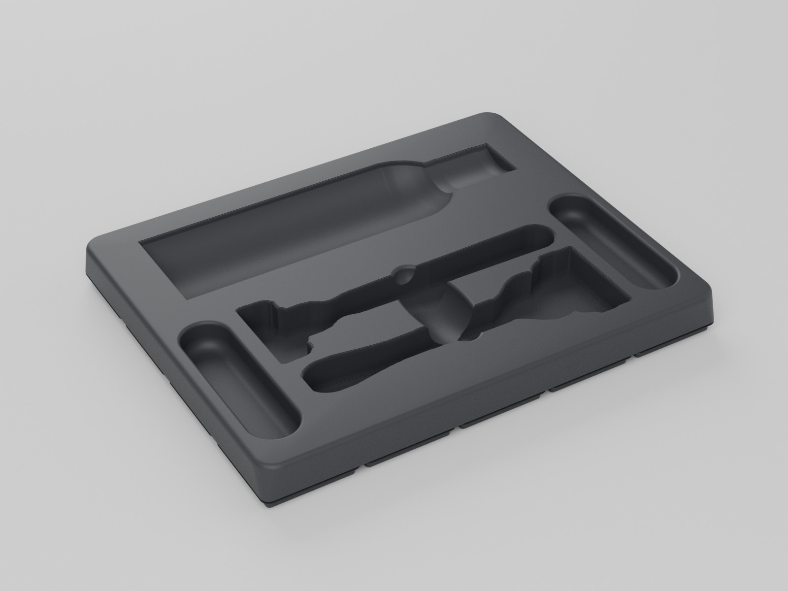
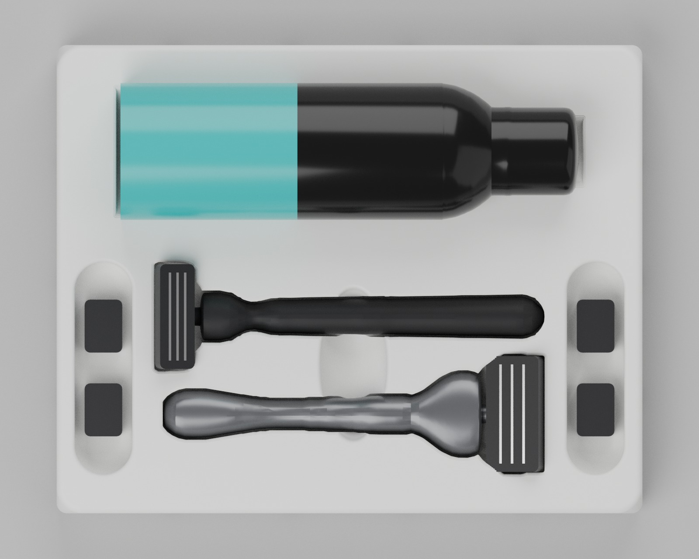

# Gridfinity Rasier-Station

Ein einziges Gridfinity-Teil für die Schublade. Alles liegt flach in seiner eigenen Mulde:

- **Gillette Shave Foam Sensitive** (Rasierschaum-Dose) hinten, in einer Mulde genau in Dosenform
- **Gillette Fusion5 ProGlide** und **der kleine 3-Klingen-Rasierer** mit gebogenem Chromhals (für Körper und Intimbereich) vorne, Kopf an Fuß
- **zwei Klingenfächer** links und rechts der Rasierer für lose Ersatzklingen

| Datei | Raster | Maße | Filament* |
|---|---|---|---|
| `stl/rasier_station_5x4x3u.stl` | 5 × 4 | 209,5 × 167,5 × 21 mm | ca. 207 g |
| `stl/passtest.stl` | – | 3 mm hoch | ca. 7 g |

\* Mit PrusaSlicer gesliced: PLA, 0,2 mm Schichthöhe, 2 Wände, 15 % Gyroid.

Die Dose ragt 34,5 mm aus der Station, mit Dose ist alles 55,6 mm hoch (ohne Grundplatte).

## Gestaltung

Gedacht wie der Einsatz in einer Apple-Verpackung: ruhige Flächen, weiche Radien, jedes Teil in seiner passgenauen Mulde.

- **Ein Körper** statt drei Einzelteilen, die Rastergröße rechnet das Modell aus den Maßen selbst aus.
- **Weiche Ecken:** unten 3,75 mm wie jedes Gridfinity-Teil, nach oben weiter auf 9 mm. Die Oberkante ist mit 2,5 mm gerundet.
- **Schattenfuge:** Über der Grundplatte springt der Körper umlaufend 1 mm zurück. Dadurch wirkt die Station, als würde sie schweben.
- **Mulden:** Alle Kanten sind mit 1,5 mm gerundet, alle Böden ausgerundet (Rasierer 2 mm, Klingenfächer 5 mm). Wo eine Form nicht konvex ist, entsteht die Rundung in Stufen von genau einer Schichthöhe. Gedruckt sieht sie aus wie eine echte Rundung.
- **Dosenmulde:** ein Drehkörper aus dem vermessenen Dosenprofil mit Schulter und Kappe. Die Dose liegt unter ihrer Mitte auf und lässt sich von oben greifen.
- **Rasierer:** Die Mulden haben exakt den Umriss der Rasierer und greifen Kopf an Fuß ineinander. Eine ovale Griffmulde in der Mitte reicht unter beide Griffe.
- **Klingenfächer:** zwei Langlöcher, je 20,5 × 75,9 mm und 12 mm tief, mit tief ausgerundetem Boden. Klingen lassen sich mit einem Finger herausschieben.

## Woher die Formen kommen

| Teil | Quelle | Genauigkeit |
|---|---|---|
| kleiner Rasierer | dein Foto von oben (IMG_8033), Seitenfoto (IMG_8035) für die Höhen | Umriss exakt, Größe über den Maßstab |
| Dose | dein Foto von oben (IMG_8036) | Länge/Durchmesser exakt, Größe über den Maßstab |
| ProGlide | Produktbild aus dem Netz | Umriss gut, **Länge geschätzt** |

So wurde vermessen (`werkzeug/fotos_vermessen.py`):

1. Die Dose in IMG_8036 hat laut Hersteller **49 mm Durchmesser**. Daraus und aus der Brennweite in den EXIF-Daten folgt, dass das iPhone 221 mm über dem Tisch war. Die Dose ist demnach 163,8 mm lang.
2. Die Zifferntasten der Fernbedienung liegen in IMG_8036 und IMG_8033. Ihr Abstand überträgt den Maßstab: In IMG_8033 war die Kamera 186 mm über dem Tisch.
3. Der Rasierer wurde entlang der schattenfreien Oberkante abgetastet und an der Griffachse gespiegelt. Die Perspektive aus nur ~20 cm Abstand wird herausgerechnet: Höher liegende Teile wie der Kopf erscheinen größer und werden entsprechend verkleinert.

Ergebnis kleiner Rasierer: **138,0 mm** lang, Kopf **37,5 mm**, Griff 11,8–14,3 mm.

Die Fotos selbst liegen nicht im Repo, nur die daraus gewonnenen Umrisse in `umrisse.scad`.

## Vor dem Drucken: Passtest

Alle Fotomaße hängen an **einer Zahl: dem Dosendurchmesser** (`dose_d`, eingestellt sind 49 mm).

1. `passtest.stl` drucken (3 mm hoch, unter einer Stunde).
2. Die Dose durch den Ring schieben. Sitzt sie sauber, stimmt der Maßstab für die Dose **und** den kleinen Rasierer. Ist sie zu locker oder klemmt sie, den Durchmesser nachmessen und `dose_d` anpassen. Alles skaliert automatisch mit.
3. Den kleinen Rasierer in seinen Rahmen legen (KLEIN) und genauso den ProGlide (PROGLIDE). Die Rahmen haben genau den Umriss der Mulden. Beim ProGlide ist die Länge noch geschätzt (`pg_laenge = 135`). Passt er nicht, die Gesamtlänge vom Griffende bis zur Klingenoberkante eintragen oder ein Foto wie IMG_8033 machen (von oben, Fernbedienung daneben).

## Anpassen

- **OpenSCAD** (ab Version 2021.01): `gridfinity_rasierset.scad` öffnen (die Datei `umrisse.scad` muss daneben liegen), *Fenster → Customizer*, Werte ändern, dann F6 (Rendern) und F7 (STL exportieren).
- **Kommandozeile**: `./build.sh -D dose_d=50 -D pg_laenge=140` erzeugt die STLs und Bilder neu. Mit Blender kommen die Studio-Renderings dazu (`werkzeug/rendern.py`), `BLENDER=0 ./build.sh` lässt sie weg.
- Spiel um die Rasierer: `rasierer_spiel` (0,8 mm). Tiefe der Mulden: `rasierer_tiefe` (13 mm, der Griff liegt fast bündig).
- Klingenfächer: `fach_tiefe` (12 mm) und `fach_breite_min` (20 mm). Die Fächer füllen immer die Breite neben den Rasierern.
- Radien: `ecken_r`, `kante_r`, `mulden_r`, `boden_r`, `fach_boden_r`. Schattenfuge: `fuge` (0 = aus). Stufenhöhe der Rundungen: `schicht` (= Schichthöhe beim Drucken).
- Löcher für 6 × 2-mm-Magnete: `magnete = true` (im Bad eher weglassen, Magnete rosten).
- Neue Fotos auswerten: `werkzeug/fotos_vermessen.py` und `werkzeug/umriss_aus_bild.py` (Aufruf steht jeweils oben in der Datei).

## Druck

- Das Druckbett muss mindestens 210 × 170 mm groß sein.
- PETG ist im Bad die bessere Wahl, PLA geht auch. Mit mattem Filament in Weiß oder Grau sind Schichtlinien kaum zu sehen.
- So drucken, wie exportiert: Füße nach unten. Keine Stützen und kein Brim nötig. PrusaSlicer meldet „Long bridging extrusions“: Das sind die 0,5 mm schmalen Spalte zwischen den Gridfinity-Füßen, die gleiche Meldung kommt auch bei einem leeren 5 × 4-Block ohne Mulden. Sie kann ignoriert werden.
- 0,2 mm Schichthöhe, 2–3 Wände, 10–15 % Infill. Mit 0,12–0,16 mm werden die Rundungen glatter, dann `schicht` auf denselben Wert setzen und neu exportieren.
- Für den Apple-Look: **Bügeln (Ironing)** für die oberste Fläche einschalten, Naht auf *Hinten* legen.
- Zweifarbig: Farbwechsel bei etwa 6 mm Höhe. Füße und Schattenfuge werden dann dunkel, der Körper hell, und die Fuge wirkt noch tiefer.

## Gridfinity

42-mm-Raster, 7-mm-Höheneinheit und Fußprofil 0,8 / 1,8 / 2,15 mm nach Zack Freedmans Spezifikation. Die Station passt in jede Standard-Grundplatte. Eine Stapellippe gibt es nicht, weil darauf nichts gestapelt wird.

Schnelle Vorschau ohne Blender, direkt aus OpenSCAD: [bilder/uebersicht.png](bilder/uebersicht.png)
