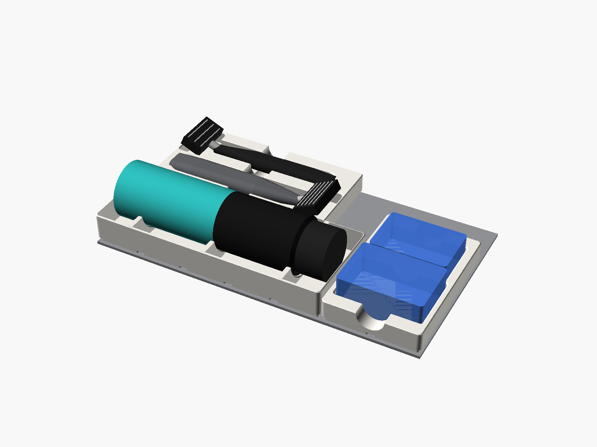
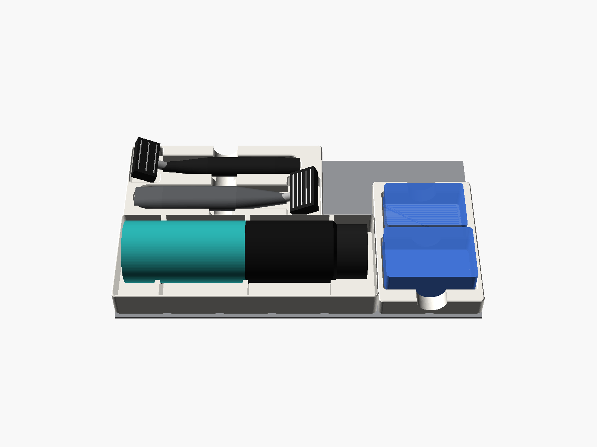
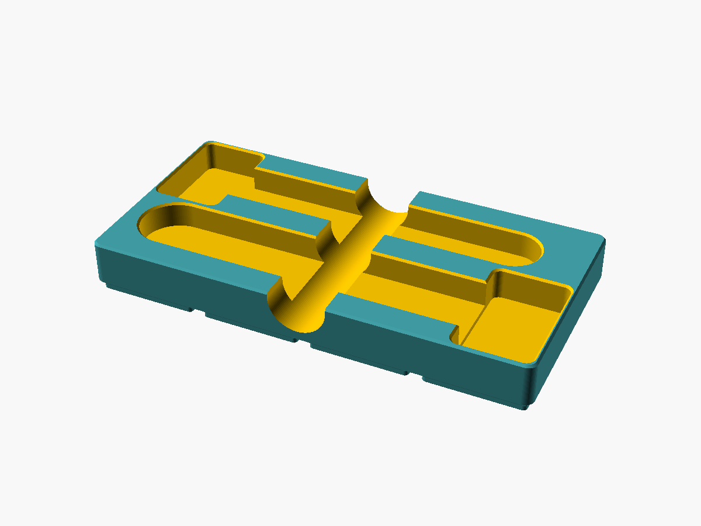
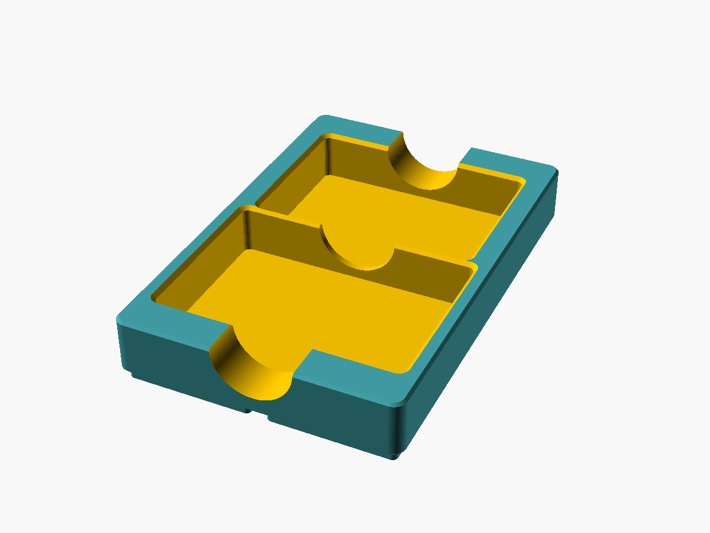
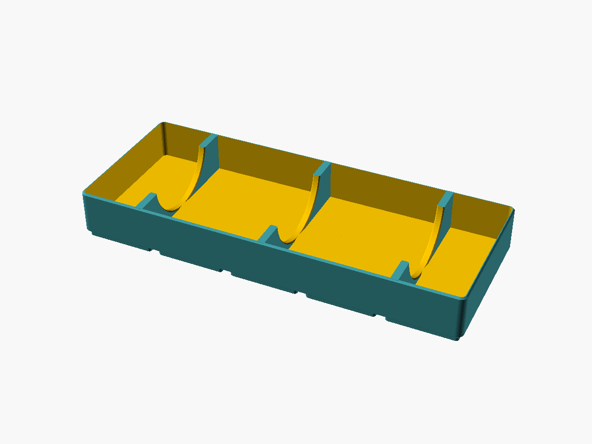
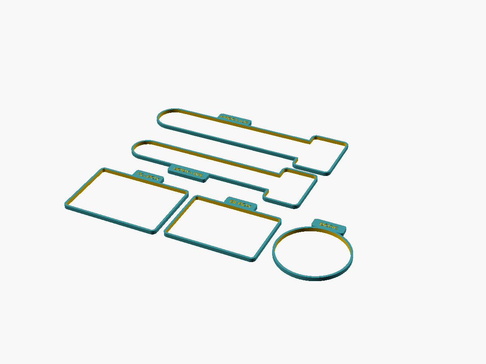

# Gridfinity Rasier-Set (liegend, für die Schublade)

Halter für:

- **Gillette Shave Foam Sensitive** (200-ml-Dose)
- **Gillette Fusion5 ProGlide** (mit FlexBall)
- **GilletteLabs Body + Intimate**: der kleine Rasierer mit 3 Klingen, gebogenem Chromhals und kurzem Griff, den Gillette für Körper und Intimbereich verkauft
- die **Plastik-Klingenboxen** beider Rasierer

## Teile

| Datei | Raster | Höhe | Inhalt | Filament* |
|---|---|---|---|---|
| `stl/rasierschaum_wiege_5x2x4u.stl` | 5 × 2 | 28 mm | Dose liegt auf drei Auflagestegen | ca. 86 g |
| `stl/rasierer_halter_4x2x3u.stl` | 4 × 2 | 21 mm | beide Rasierer Kopf an Fuß, Griffmulde in der Mitte | ca. 82 g |
| `stl/klingenbox_halter_2x3x3u.stl` | 2 × 3 | 21 mm | beide Klingenboxen flach, mit Griffmulde | ca. 55 g |
| `stl/passtest.stl` | – | 3 mm | Umrisse aller Mulden zum Probedrucken | ca. 11 g |

\* Mit PrusaSlicer gesliced: PLA, 0,2 mm Schichthöhe, 2 Wände, 15 % Gyroid.

Zusammen belegt das Set 24 Rasterfelder (siehe Draufsicht unten).

**Warum beide Rasierer in einem Halter?** Der Klingenkopf ist mit ca. 43 mm breiter als eine Rastereinheit (41,5 mm). Schon ein einzelner Rasierer braucht deshalb 2 Einheiten Breite. Kopf an Fuß passt der zweite in denselben Platz. Einzelne Halter gibt es über `rasierer_auswahl`.

## Vor dem Drucken: Maße prüfen

Die Maße sind Schätzwerte aus Herstellerangaben und dem Foto, nicht nachgemessen. Sie sind bewusst etwas großzügig gewählt. Deshalb zuerst:

1. `passtest.stl` drucken (3 mm hoch, geht schnell).
2. Rasierer in die Umrisse legen, Boxen in die Rahmen legen, Dose durch den Ring schieben.
3. Passt etwas nicht: nachmessen, Wert ändern, neu exportieren (siehe unten).

| Wert | Parameter | angenommen |
|---|---|---|
| Dose: Durchmesser | `dose_d` | 50 mm |
| Dose: Länge inkl. Kappe | `dose_l` | 193 mm |
| ProGlide: Gesamtlänge | `pg_laenge` | 156 mm |
| ProGlide: Kopfbreite | `pg_kopf_b` | 43 mm |
| ProGlide: Griff an der breitesten Stelle | `pg_griff_b` | 24 mm |
| Body + Intimate: Gesamtlänge | `bi_laenge` | 145 mm |
| Body + Intimate: Kopfbreite | `bi_kopf_b` | 39 mm |
| Body + Intimate: Griff an der breitesten Stelle | `bi_griff_b` | 19 mm |
| ProGlide-Klingenbox: L × B × H | `pg_box_l`, `pg_box_b`, `pg_box_h` | 72 × 50 × 30 mm |
| Body+Intimate-Klingenbox: L × B × H | `bi_box_l`, `bi_box_b`, `bi_box_h` | 66 × 46 × 28 mm |

Das Spiel rechnet das Modell selbst dazu (pro Seite: Rasierer 1 mm, Boxen 0,6 mm, Dose 0,8 mm). Wird etwas größer, wächst die Rastergröße automatisch mit. Sie steht dann auch im Dateinamen.

## Anpassen

- **OpenSCAD** (ab Version 2021.01): `gridfinity_rasierset.scad` öffnen, *Fenster → Customizer*, Werte ändern, oben bei `teil` das Teil wählen, dann F6 (Rendern) und F7 (STL exportieren).
- **Kommandozeile**: `./build.sh -D dose_d=52 -D pg_laenge=150` erzeugt alle STLs und Bilder neu.
- Mehrere Klingenboxen pro Rasierer: `pg_box_anzahl`, `bi_box_anzahl`.
- Nur ein Rasierer pro Halter: `rasierer_auswahl = "proglide"` oder `"body_intimate"`.
- Löcher für 6 × 2-mm-Magnete: `magnete = true` (im Bad eher weglassen, Magnete rosten).

## Druck

- PETG ist im Bad die bessere Wahl, PLA geht auch.
- So drucken, wie exportiert: Füße nach unten. Keine Stützen und kein Brim nötig.
- 0,2 mm Schichthöhe, 2–3 Wände, 10–15 % Infill.
- Die Wiege ist 209,5 mm lang, das Druckbett muss also mindestens so groß sein.

## Gridfinity

42-mm-Raster, 7-mm-Höheneinheit und Fußprofil 0,8 / 1,8 / 2,15 mm nach Zack Freedmans Spezifikation. Die Teile passen in jede Standard-Grundplatte. Eine Stapellippe gibt es nicht, weil auf diesen Haltern nichts gestapelt wird.

| Rasierer-Halter | Klingenbox-Halter | Rasierschaum-Wiege | Passtest |
|---|---|---|---|
|  |  |  |  |
